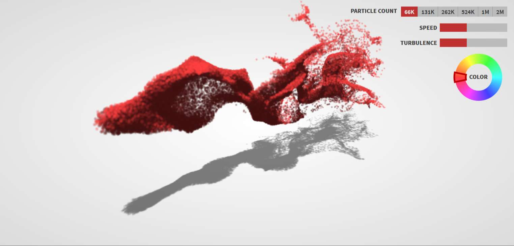
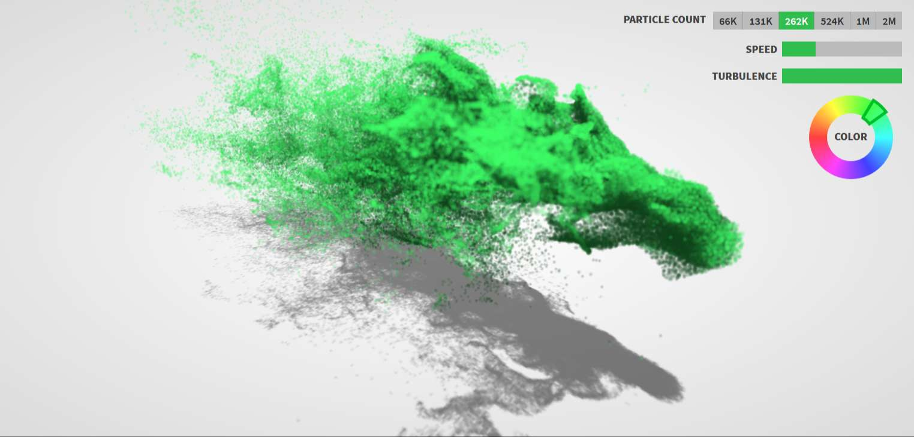
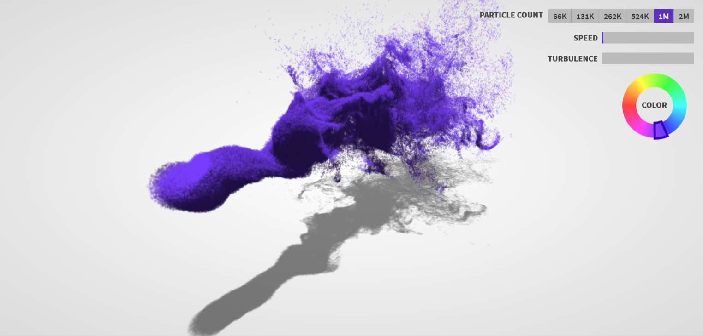

<h1 class="center">

</h1> 

<h2 class="center">

</h2>

 

در این پروژه سعی شده است تا با استفاده از کتابخانه های جاوا اسکریپت حرکت فیزیکی ذرات معلق در هوا شبیه سازی شود.

در این شبیه سازی 3 متغییر وجود دارد :

- تعداد ذرات
- سرعت حرکت
- تلاطم یا آشفتگی ذرات

<h1 class="center">

</h1>

البته توجه داشته باشید که افزایش متغیر تعداد ذرات نیازمند سیستم پردازش قوی تری نیز خواهد بود. برای مثال نمایش 1 میلیون ذره با سرعت و تلاطم پیشفرض روی سیستمی با مشخصات زیر به راحتی صورت می پذیرد :

- پردازنده : Intel i7-8700K
- کارت گرافیک : Nvidia GeForce GTX 1070

<h1 class="center">

</h1>
