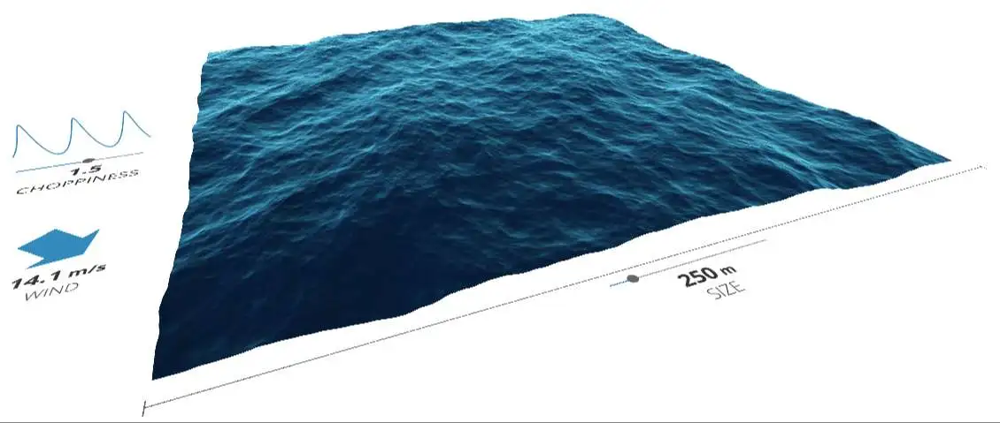
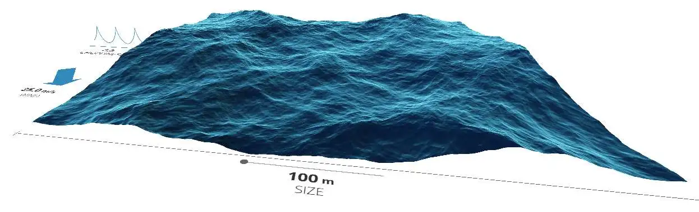

<h1 class="center">

</h1> 

<h2 class="center">

</h2>

 

در این پروژه سعی شده تا شرایط فیزیکی موج های دریا شبیه سازی شود. توسط کنترلر هایی که وجود دارد می توانید سرعت باد ، ارتفاع و طول مول موج را تغییر داده و در لحظه شبیه سازی صورت گرفته را مشاهده کنید.

<h1 class="center">

</h1>
