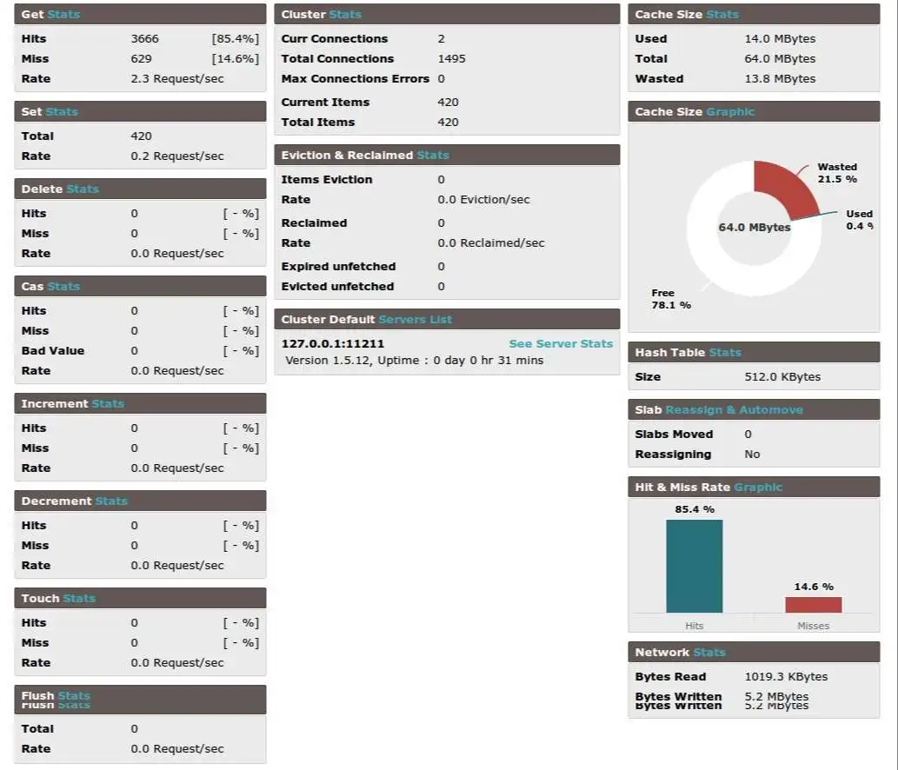

<h1 class="center">

</h1>

<div class="center badges">


</div>

<h2 class="center">


</h2>



این پروژه به شما اجازه میده که وضعیت سرور های Memcached خودتون رو به صورت زنده مشاهده کنید. مواردی از جمله :

- عملیات های get, set, delete, increment, decrement, evictions, reclaimed
- شبکه ( ترافیک و پهنای باند )
- حافظه و هدررفت آن
- ...

همچنین توانایی اجرای دستورات مختلفی را نیز دارید :

- get, set, delete, flush_all, ...
- دریافت داده ها
- حذف کلید ها
- پاک کردن کل داده ها
- اجرای دستورات telnet
- جستجو
- ...

<h1 class="center">

</h1><br>

## نصب

این پروژه داکرایز شده است و به راحتی می توانید از آن استفاده کنید. قابلیت استفاده برای یک یا چند سرور وجود داره.

**نصب برای یک سرور :**

```sh
docker run --rm -p 8080:80 -e MEMCACHED_HOST='127.0.0.1' -e MEMCACHED_PORT='11211' hatamiarash7/memcached-admin:master
```

**نصب برای چند سرور ( کلاستر ) :**

```sh
docker run --rm -p 8080:80 -e MEMCACHED_HOST='127.0.0.1:11211,127.0.0.1:11212' hatamiarash7/memcached-admin:master
# or
docker run --rm -p 8080:80 -e MEMCACHED_HOST='127.0.0.1,127.0.0.2' -e MEMCACHED_PORT='11211' hatamiarash7/memcached-admin:master
# or
docker run --rm -p 8080:80 -e MEMCACHED_HOST='127.0.0.1:11212,127.0.0.1' -e MEMCACHED_PORT='11211' hatamiarash7/memcached-admin:master
```

می توانید کلاستر خود را در بخش Configuration تنظیم نمایید.
