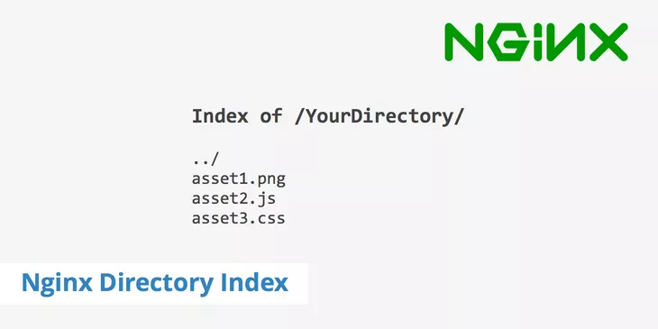

<h1 class="center">

</h1>

<h2 class="center">

</h2>



بعضی مواقع نیاز دارید تا به چندتا فایل روی سرور خودتون دسترسی داشته باشید و اونا رو روی سیستم خودتون دانلود کنید. خب در حالت عادی این کار خیلی دردسر داره و نیاز به وقت و کار زیاد داره. با استفاده از این پروژه میتونید خیلی سریع و راحت یک کانتینر بسازید و به Nginx اجازه بدید تا در محل مورد نظر یک Directory Index ایجاد کند.

## نصب و استفاده

به سادگی کانتینر خودتون رو اجرا کرده و دایرکتوری مورد نظرتون رو به آدرس `data/` مپ کنید. برای مثال میخواهیم فایل های Log سیستم عامل رو دانلود کنیم :

```sh
docker run -p 8080:80 -v /var/log:/data hatamiarash7/directory-index
```

با مراجعه به آدرس `http://127.0.0.1:8080` می تونید ایندکس خودتون رو مشاهده کنید.
