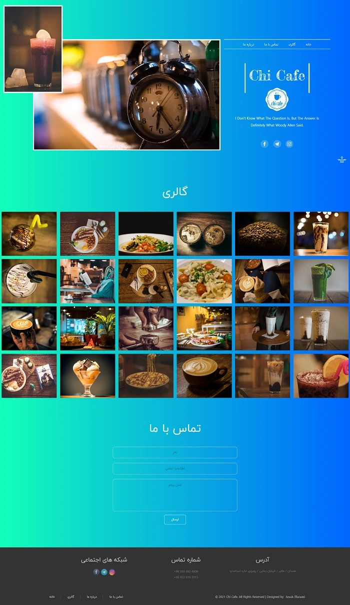

<h1 class="center">

</h1>

<h2 class="center">

</h2>

 

<ul>
    <li>
        سال طراحی : 1397
    </li>
    <li>
        فریمورک / زبان برنامه نویسی : Laravel ( PHP )
    </li>
    <li>
        تکنولوژی ها :  Gulp, Sass, Redis, MySQL
    </li>
</ul>
