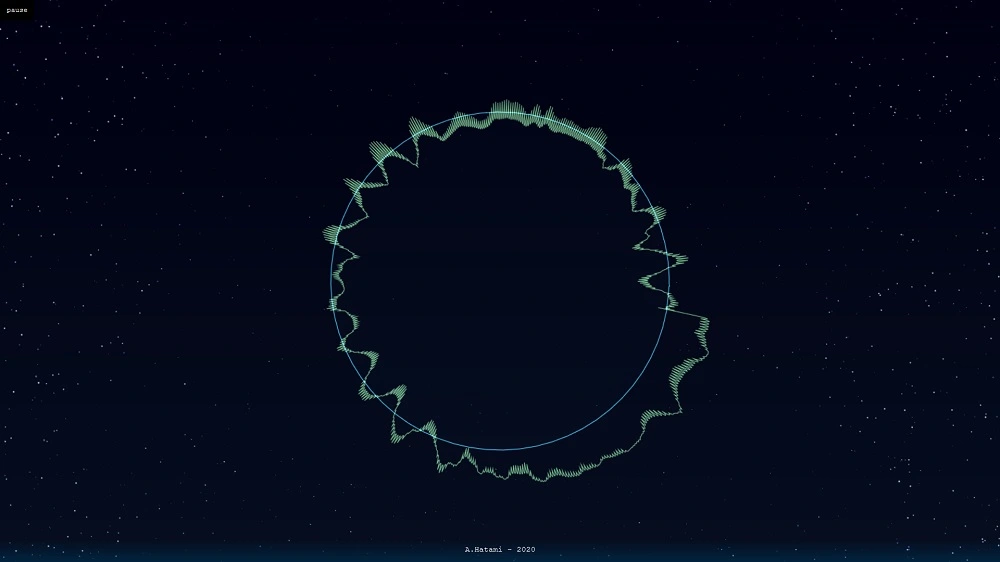

<h1 class="center">

</h1>

<h2 class="center">

</h2>

<br>

این پروژه با استفاده از جاوا اسکریپت فایل های صوتی را مصور می کند و یک Visualizer دایره ای می سازد.

## اجرا

این پروژه داکرایز شده و می توانید راحت و سریع آن را اجرا کنید. فایل صوتی خود را در پوشه `media` قرار داده و دستور زیر را اجرا کنید :

```sh
docker-compose up --build
```

> توجه داشته باشید که فایل `index.html` را مستقیما نمیتوانید اجرا کنید و با هشدار `Cross-Origin Request Blocked` مواجه خواهید شد. ساده ترین راه استفاده از وب سرور بوده که با داکرایز شدن پروژه و اجرا با Nginx این مشکل برطرف می شود.
>
> در صورتی که داکر نصب نکرده اید می توانید از یک وب سرور محلی یا ابزار هایی مانند XAMPP استفاده کنید.
