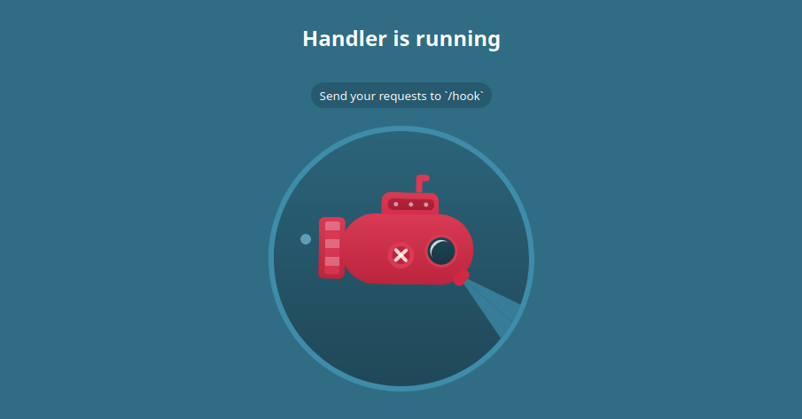
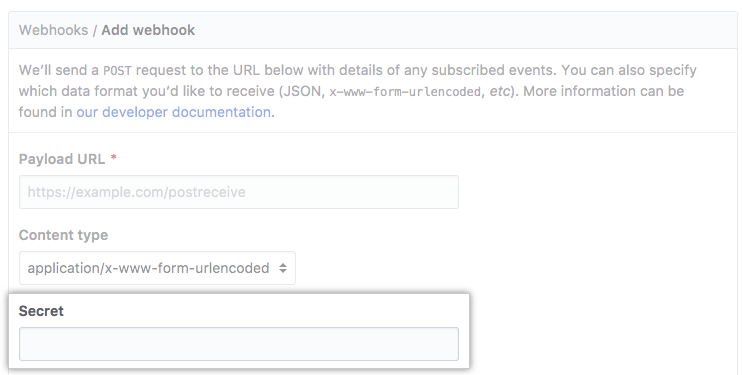

<h1 class="center">

</h1>

<h2 class="center">

</h2>



## تعریف

وب‌هوک به یک فراخوانی ( Callback ) از جنس HTTP در سمت سرور گفته می‌شود که توسط برنامه‌نویس تعیین می‌شود. این درخواست غالبا با متد POST بوده و در هنگام بروز یک رخداد خاص صدا زده می‌شود.

به عنوان مثال ، فرض کنید یک مخزن روی سایت گیت‌هاب دارید و می‌خواهید هر بار که به آن مخزن Push می‌کنید، به نحو خاصی به شما اطلاع داده شود (مثلا به حساب تلگرام شما یک پیام ارسال شود.) در این صورت، یک سرویس تحت وب ایجاد می‌کنید که هربار URL مربوطه‌اش صدا زده شود، این رخداد را از طریق تلگرام به اطلاع شما برساند. سپس URL سرویس تحت وب ایجاد شده را در بخش Webhook از تنظیمات مخزن‌تان اضافه می‌کنید.

> بکتوری

## این پروژه چیه ؟

در حال حاضر این پروژه مخصوص نرم افزار های مدیریت مخازن نرم افزاری مانند Github, Gitlab, Gitea و غیره طراحی شده ولی با تغییرات کوچک میتونید اون رو برای هر منظور دیگه ای استفاده کنید.

## نصب و اجرا

این پروژه با استفاده از جاوا اسکریپت و NodeJS نوشته شده که اجرا کردنش ساده است. یا مستقیما خود پروژه رو با استفاده از Node اجرا کنید یا اینکه با Docker این کار رو انجام بدید :

```sh
git clone https://github.com/hatamiarash7/WebhookHandler
cd WebhookHandler
npm install
node hook.js
```

یا

```sh
docker pull hatamiarash7/webhook
docker run hatamiarash7/webhook
```

## تنظیمات

برای کار با پروژه نیاز به یک فایل `env.` دارید که باید به این صورت تنظیم بشه :

```env
SECRET=changeme
DB_CONNECTION="mongodb://localhost:27017/webhook"
PROVIDER=github
SIGNATURE="X-Hub-Signature"
LOG_LEVEL=info
```

- `SECRET` : این مقدار باید در تنظیمات Webhook در نرم افزار مورد نظر گرفته شود. در بخش بعدی به آن خواهیم پرداخت.
- `DB_CONNECTION` : از این متغیر برای اتصال به دیتابیس Mongo استفاده می شود. جهت اطلاعات بیشتر به [این لینک](https://docs.mongodb.com/manual/reference/connection-string/) مراجعه کنید.
- `PROVIDER` : انتخاب فرستنده. برای مثال : github, gitea, ...
- `SIGNATURE` : از این گزینه برای تعریف Header ارسال شده استفاده می شود و با توجه به مبدا متفاوت خواهد بود. مقدار دقیق را باید از بخش مستندات مربوط به نرم افزار مورد نظر پیدا کنید. نمونه ها :
  - **Github** : X-Hub-Signature
  - **Gitlab** : X-Gitlab-Token
  - **Gogs** : X-Gogs-Signature
  - **Gitea** : HTTP_X_GITEA_SIGNATURE

## استفاده

ابتدا در نرم افزار مورد نظر به قسمت تنظیمات Webhook مراجعه کنید. برای مثال در گیت هاب با چنین صفحه ای مواجه خواهید شد :

<h1 class="center">

</h1>

- در قسمت Payload URL باید آدرس این پروژه را بعد از اجرا وارد کنید. برای مثال : `http://webhook.domain.com/hook`
- در قسمت Content Type گزینه `application/json` را انتخاب کنید. این گزینه نوع داده های ارسالی را مشخص میکند که این پروژه با Json کار می کند.
- در قسمت Secret باید یک رشته تعریف شود که به عنوان رمز عبوری ساده جهت اعتبارسنجی درخواست های ارسال شده به کار می رود. توجه کنید این فیلد همان مقداری است که باید در فایل `env.` هم وارد کنید.

پس از تنظیم میتوانید پروژه را اجرا نمایید تا درخواست ها به آن ارسال شده و در پایگاه داده Mongo ذخیره شوند.

## بعد از این چی ؟

توجه کنید که این پروژه فقط یک Parser ساده است و هیچگونه محیط گرافیکی نداره. در صورتی که نیاز به مصورسازی داده هاتون دارید خودتون دست به کار بشید 😊 یا اینکه محیط گرافیکی رو به همین پروژه اضافه کنید تا بقیه هم ازش بهره مند بشن 😍
