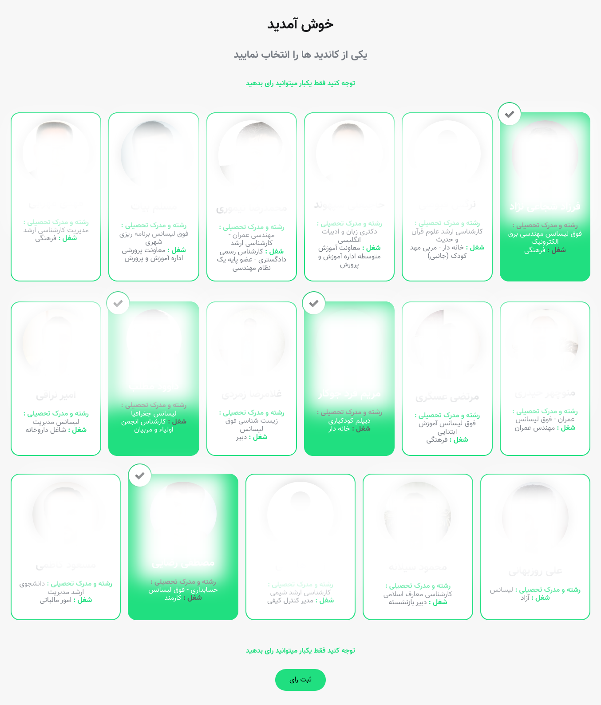
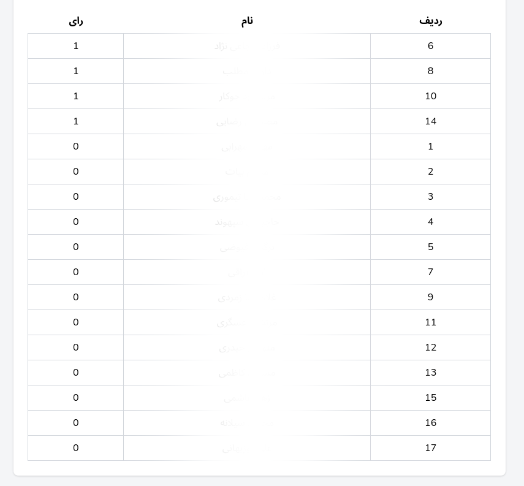

<h1 class="center">

</h1>

<h2 class="center">

</h2>



## تصاویر

<h1 class="center">
<figure>

<figcaption>صفحه انتخاب کاندید ها</figcaption>
</figure>
</h1>

<h1 class="center">

</h1>

<h1 class="center">
<figure>

<figcaption>نتایج نظرسنجی در پنل مدیریت</figcaption>
</figure>
</h1>
