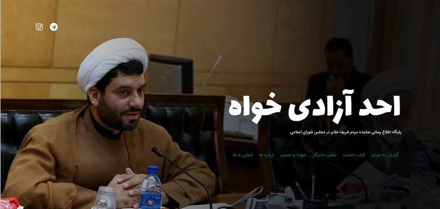
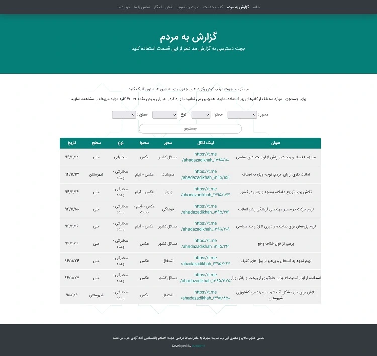
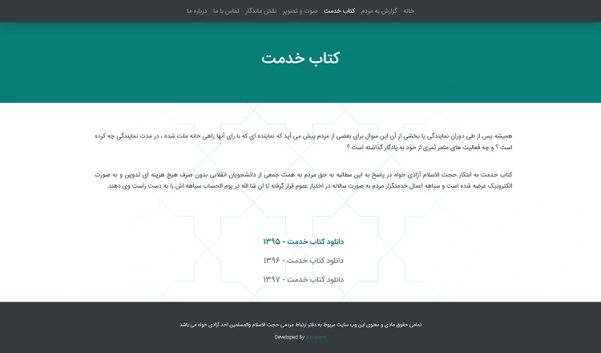
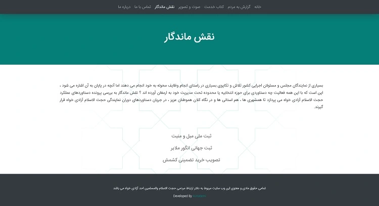
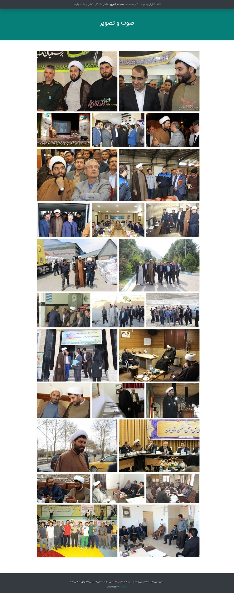

<h1 class="center">

</h1>

<h2 class="center">

</h2>

 

<ul>
    <li>
        سال طراحی : 1398
    </li>
    <li>
        فریمورک / زبان برنامه نویسی : Laravel ( PHP )
    </li>
    <li>
        تکنولوژی ها :  Redis - MySQL - Python و ...
    </li>
</ul>

## تصاویر

<h1 class="center">
<figure>

<figcaption>صفحه اصلی</figcaption>
</figure>
</h1>

<h1 class="center">
<figure>

<figcaption>گزارش به مردم - ایندکس و جستجوی هزاران گزارش در طول خدمت</figcaption>
</figure>
</h1>

<h1 class="center">
<figure>

<figcaption>کتاب خدمت - دانلود کتابچه های تدوین شده</figcaption>
</figure>
</h1>

<h1 class="center">
<figure>

<figcaption>نقش ماندگار</figcaption>
</figure>
</h1>

<h1 class="center">
<figure>

<figcaption>محتوای چندرسانه ای</figcaption>
</figure>
</h1>

