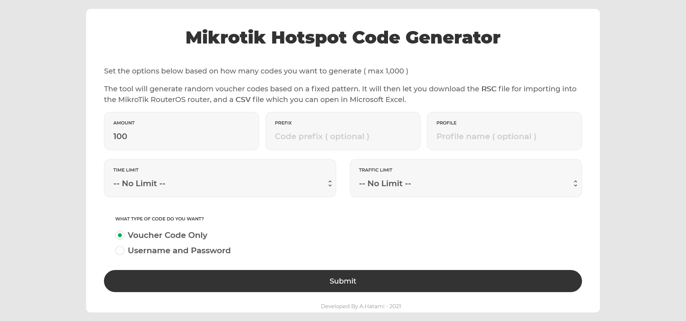
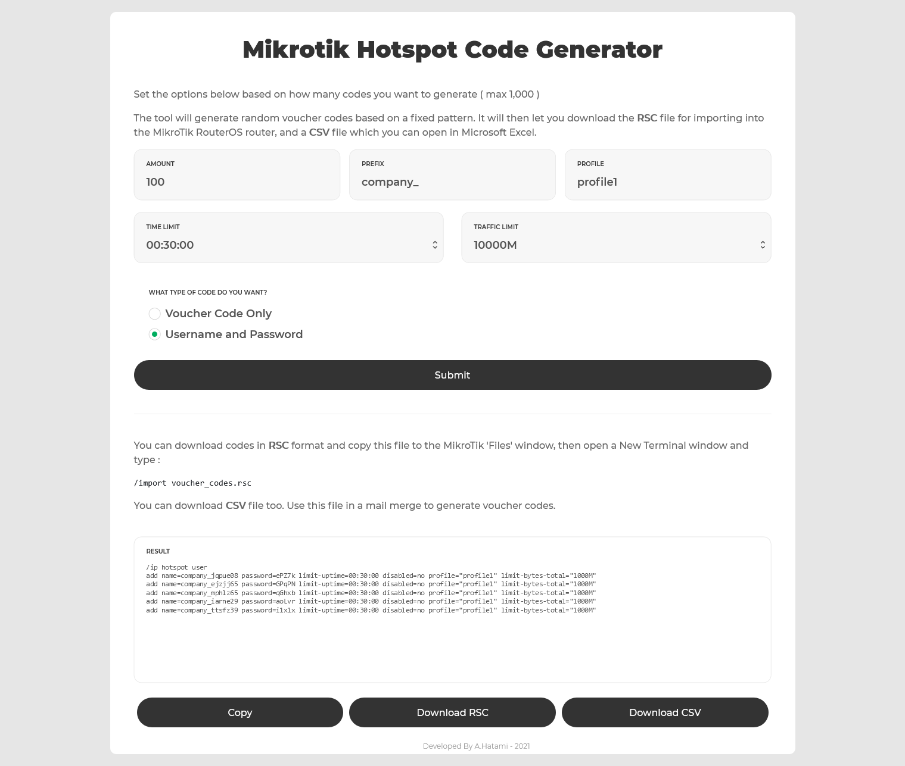

<h1 class="center">

</h1>

<h2 class="center">

</h2>



یکی از کاربردی ترین ویژگی های روتر میکروتیک ، ارائه Hotspot بوده که تمام نیازهای شما رو برطرف میکنه. شما میتونید برای کاربر های مختلف حساب کاربری ایجاد کنید و سطوح دسترسی و استفاده هم براشون در نظر بگیرید.

چنین کاری در مجموعه های کوچک ساده است و به صورت دستی هم انجام میشه ولی در مجموعه های بزرگ با تعداد کاربران بالا روند سخت و دشواری رو پیش روی شما قرار میده. فرض کنید مثلا برای 1000 نفر بخواهید حساب کاربری ایجاد کنید !!!

با استفاده از این سامانه چنین کاری بسیار ساده و سریع انجام میشه

<h1 class="center">

</h1>

در اینجا شما 6 گزینه پیش رو دارید :

- **Amount :** از این فیلد برای تعیین تعداد کدهای تولید شده استفاده می شود. برای مثال شما میخواهید 10 کد تولید کنید
- **Prefix :** با استفاده از این فیلد می توانید یک پیشوند به تمام یوزرنیم ها اضافه کنید. برای مثال نام شرکت را وارد می کنید
- **Profile :** اگر میخواهید کدها را برای پروفایل خاصی از تنظیمات Hotspot خود تولید کنید در این فیلد وارد می کنید. برای مثال موقتا مهمانانی دارید و میخواهید سطح دسترسی محدودی در روتر خود ایجاد کنید. یک پروفایل جدا تعرف کرده و از آن استفاده می کنید.
- **Time Limit :** برای تعیین محدودیت زمانی می توانید از این فیلد استفاده کنید. برای مثال تعریف میکنید که هر حساب کاربری 30 دقیقه بتواند از شبکه استفاده کند
- **Traffic Limit :** با استفاده از این فیلد می توانید محدودیت حجمی تعیین کنید. برای مثال هر حساب کاربری نهایتا 1 گیگابایت اجازه استفاده از ترافیک دارد

در نهایت می توانید کدهای خود را به صورت Voucher یا یوزرنیم پسورد عادی تولید کنید.

اسکریپت تولید شده در دو قالب CSV و RSC در دسترس شماست. جهت سهولت می توانید فایل RSC را دانلود کرده و در دستگاه میکروتیک با استفاده از دستور زیر آن را اجرا نمایید :

```bash
/import voucher_codes.rsc
```

همچنین با استفاده از پروژه [داشبورد میکروتیک](/projects/05-mikrotik-dashboard) می توانید حساب های کاربری را پرینت کنید.
