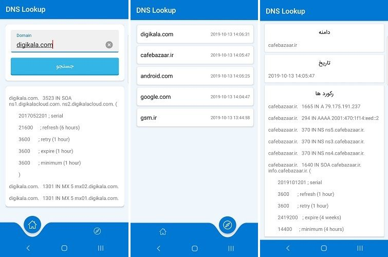

<h1 class="center">

</h1> 

<h2 class="center">


</h2>

 

## مقدمه

کاربرد اصلی رکوردهای دی ان اس اختصاص آدرس به اعداد می‌باشد مانند یک دفترچه تلفن که به هر نام یک شماره منحصر به فرد اختصاص می‌دهد. همانطور که اطلاع دارید هر دستگاه یا میزبان هاستی که به اینترنت متصل است با یک شماره اختصاصی شناسایی می‌شود که به صورت یک آدرس آی پی می‌باشد.

یک DNS سرور رکورد های مختلفی دارد از جمه :

- A
- AAAA
- CAA
- CNAME
- MX
- NS
- SPF
- TXT
- PTR
- و ...

یکی از ابزارهای مفید و مورد نیاز برای طراحان وب ، مهندسان شبکه و زیرساخت ، جستجوگر های DNS می باشند که با استفاده از آن ها می توانند رکورد های مربوط به یک دامنه را مشاهده کنند.

این پروژه یک ابزار مفید برای جستجوی رکورد های DNS یک دامنه می باشد. در دو نسخه تحت وب و اندروید ارائه شده است و کاربری ساده و کاملی را ارائه می هد.

## نسخه اندروید

<h1 class="center">

</h1>

## نسخه تحت وب

<h1 class="center">

</h1>
