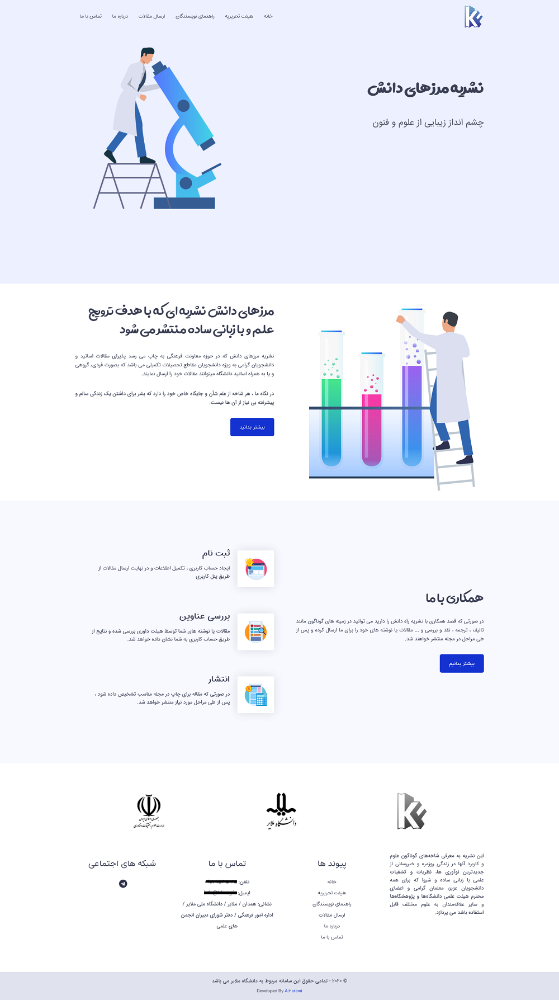
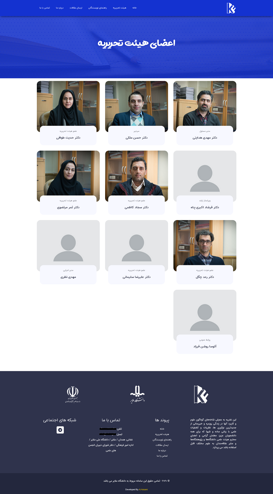
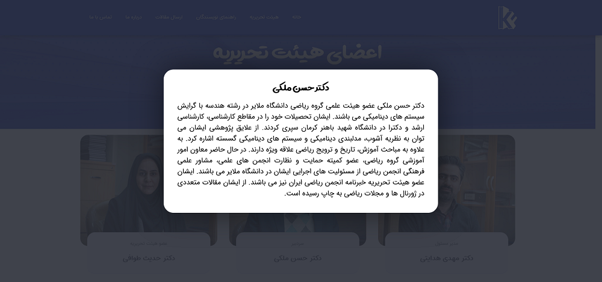
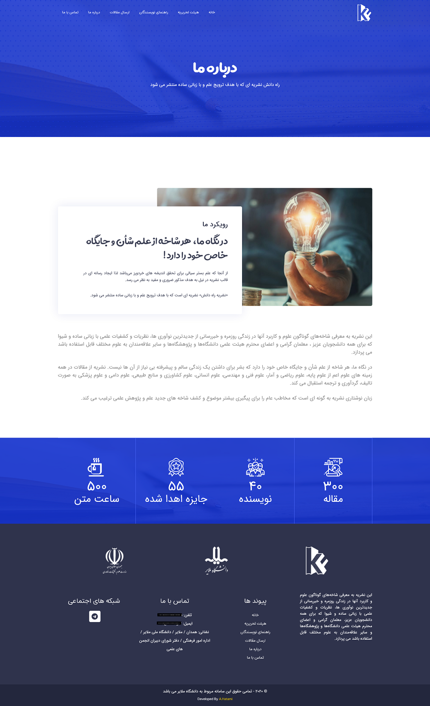
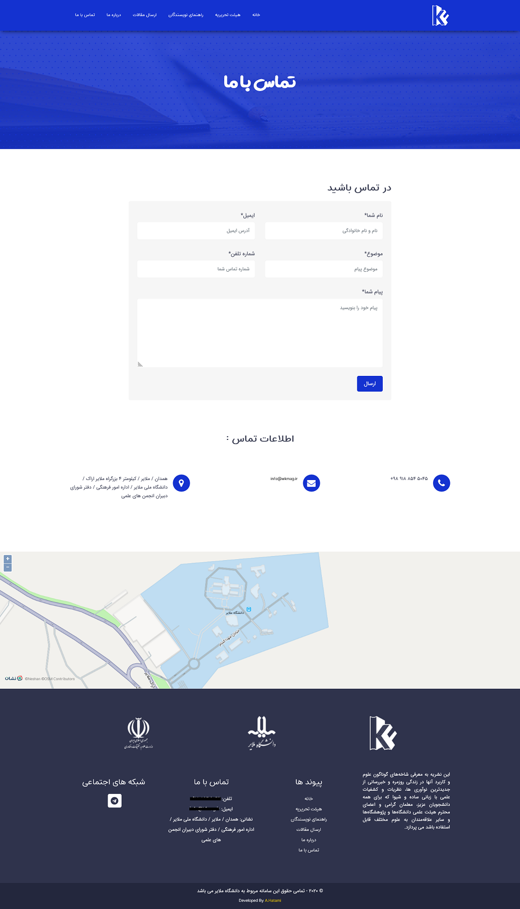

<h1 class="center">

</h1>

<h2 class="center">

</h2>



نشریه مرزهای دانش که در حوزه معاونت فرهنگی دانشگاه ملایر به چاپ می رسد پذیرای مقالات اساتید و دانشجویان گرامی به ویژه دانشجویان مقاطع تحصیلات تکمیلی می باشد که به صورت فردی و گروهی می توانند مقالات خود را ارسال نمایند.

## تصاویر

<h1 class="center">
<figure>

<figcaption>صفحه اصلی</figcaption>
</figure>
</h1>

<h1 class="center">
<figure>

<figcaption>صفحه اعضای هیئت تحریریه</figcaption>
</figure>
</h1>

<h1 class="center">
<figure>

<figcaption>پنجره نمایش اطلاعات عضو</figcaption>
</figure>
</h1>

<h1 class="center">
<figure>

<figcaption>صفحه درباره ما</figcaption>
</figure>
</h1>

<h1 class="center">
<figure>

<figcaption>صفحه تماس با ما</figcaption>
</figure>
</h1>

