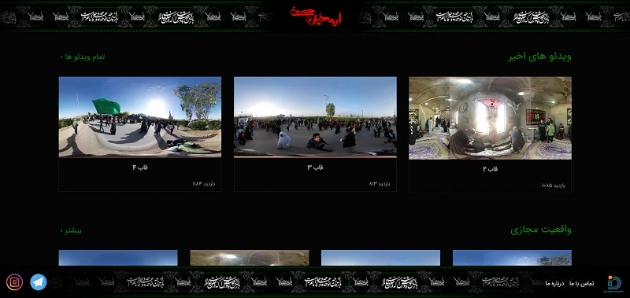
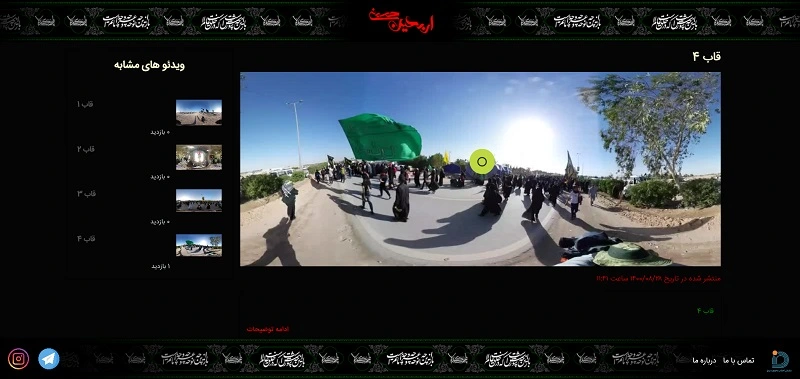
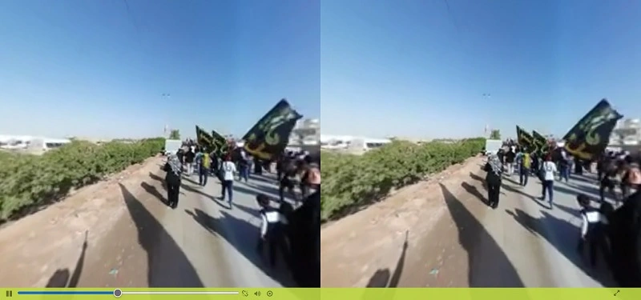
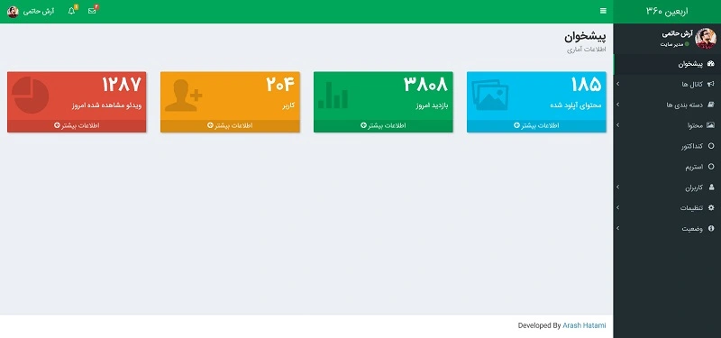

<h1 class="center">

</h1>

<h2 class="center">

</h2>



این پروژه یک سرویس ارائه ویدئوهای واقعیت مجازی با دسته بندی اربعین بوده که در سال 1398 به سفارش سازمان فضای مجازی بسیج طراحی شد. ویدئوهای این پروژه نیز به طور اختصاصی ضبط و تدوین شد.

ایده اصلی طراحی این وب سایت ، تجربه حضور در پیاده روی اربعین از راه دور بود که به رایگان و تنها با استفاده از یک عینک واقعیت مجازی و گوشی موبایل در اختیار هموطنانی که توانایی شرکت در این مراسم را ندارند قرار بگیرد.

## تصاویر

**توجه :** تصاویر قرار داده شده مربوط به نسخه آزمایشی می باشد

<h1 class="center">
<figure>

<figcaption>صفحه اصلی</figcaption>
</figure>
</h1>

<h1 class="center">
<figure>

<figcaption>صفحه محتوا</figcaption>
</figure>
</h1>

<h1 class="center">
<figure>

<figcaption>صفحه پخش - پلیر مخصوص VR</figcaption>
</figure>
</h1>

<h1 class="center">
<figure>

<figcaption>پنل مدیریت</figcaption>
</figure>
</h1>
