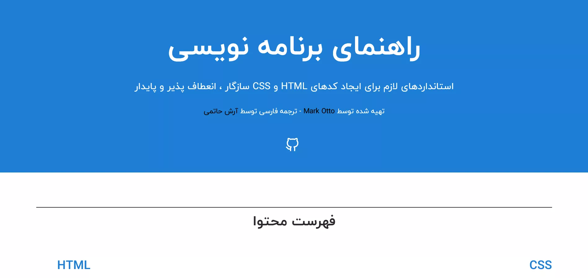

<h1 class="center">

</h1>

<h2 class="center">

</h2>



راهنمای کد مجموعه ای از استانداردها برای توسعه HTML و CSS سازگار، انعطاف پذیر و پایدار است. این از سالها تجربه در نوشتن کد در پروژه های با اندازه های مختلف ناشی می شود. این پایان همه چیز نیست، بلکه یک شروع است.

ایده اصلی این کار توسط [Mark Otto](https://github.com/mdo) پیاده سازی شده و هم اکنون به 15 زبان دنیا ترجمه شده که ترجمه فارسی این پروژه رو بنده انجام دادم.
