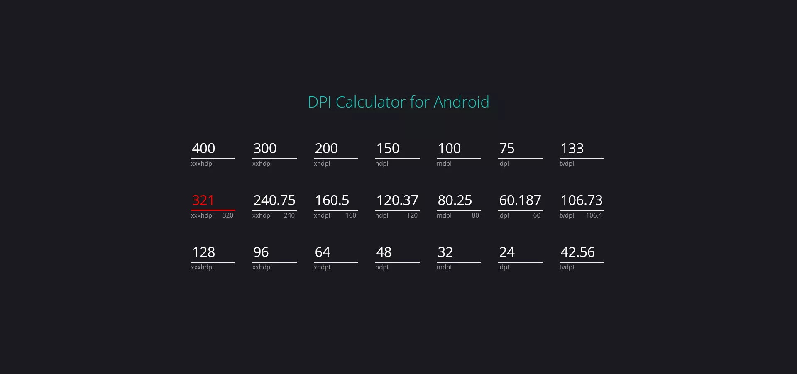

<h1 class="center">

</h1>

<h2 class="center">

</h2>

 

<ul>
    <li>
        سال طراحی : 1400
    </li>
    <li>
        فریمورک / زبان برنامه نویسی : Javascript
    </li>
    <li>
        تکنولوژی ها :  -
    </li>
</ul>

با استفاده از این سامانه می توانید محاسبات DPI را بین سایزهای مختلف صفحه نمایش در اندروید انجام بدید. عدد DP مورد نظر را در سایز معیار خودتون وارد کنید تا در باقی اندازه ها عدد معادل به شما داده بشه.

در صورتی که مشکلی وجود داشته باشه و اندازه مورد نظر در یکی از سایز ها اعشار داشته باشه ، فیلد ورودی به رنگ قرمز در میاد تا متوجه بشید.
