<h1 class="center">
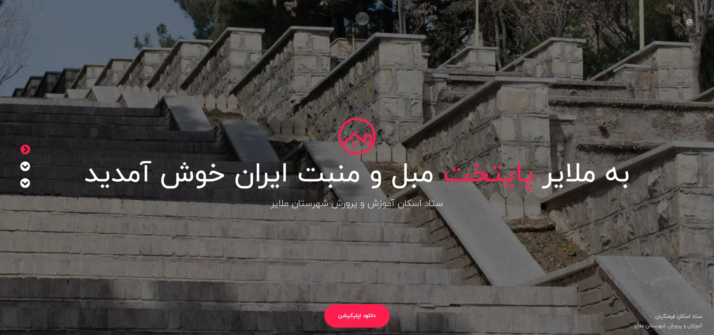
</h1>

<h2 class="center">

</h2>



این پروژه شامل دو بخش اپلیکیشن اندروید و سمت سرور بوده که به سفارش آموزش و پرورش شهر ملایر در سال 98-1397 ( قبل از کرونا و تعطیل شدن سفر ها 😓 ) طراحی شد. مسافرینی که قصد استفاده از تسهیلات نوروزی ستاد فرهنگیان را دارند باید در هر شهر به ستاد مرکزی راهنمایی شده و پس از پذیرش از آنجا به مراکز در نظر گرفته شده جهت اسکان راهنمایی بشوند. در گذشته این روند به صورت سنتی ( نقشه ها و آدرس کاغذی ) انجام میشد.

اما با پیشرفت تکنولوژی و وجود گوشی های هوشمند و اینترنت همراه میشه این روند رو به روزرسانی کرد و همه چیز با یک اپلیکیشن انجام بشه. این برنامه توسط مسئولین مربوطه در ورودی شهر به مسافرین عزیز داده میشد تا به راحتی باقی مراحل را انجام دهند.

## وب سایت

جهت سهولت کار ، یک وب سایت ساده طراحی شد تا مسافرین با مراجعه به آن اپلیکیشن را دانلود نمایند ( بیخیال بلوتوث !!! 😂 )

<h1 class="center">
<figure>

<figcaption>صفحه اصلی</figcaption>
</figure>
</h1>

<h1 class="center">
<figure>
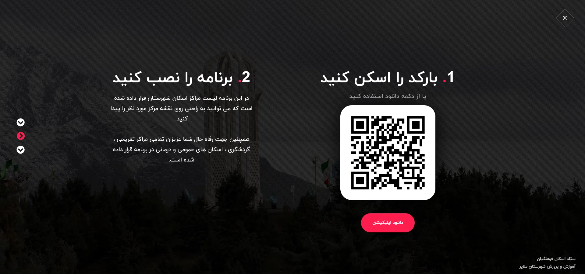
<figcaption>دانلود اپلیکیشن</figcaption>
</figure>
</h1>

<h1 class="center">
<figure>
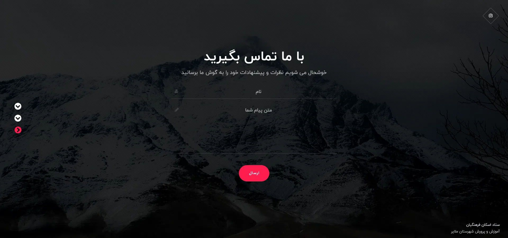
<figcaption>تماس با ما</figcaption>
</figure>
</h1>

## پنل مدیریت

یکی دیگر از قسمت های در نظر گرفته شده ، امکان ارائه لیستی از مراکز تفریحی ، گردشگری ، درمانی و ... برای مسافران است. از آن جایی که این لیست روزانه به روز شده و تغییر پیدا می کنم باید از سمت سرور گرفته بشه پس در کنار وب سایت یک API توسعه داده شد تا این لیست از سمت سرور دریافت بشه. جهت ورود و ویرایش اطلاعات نیز به طبع یک پنل مدیریت طراحی شد

<h1 class="center">
<figure>
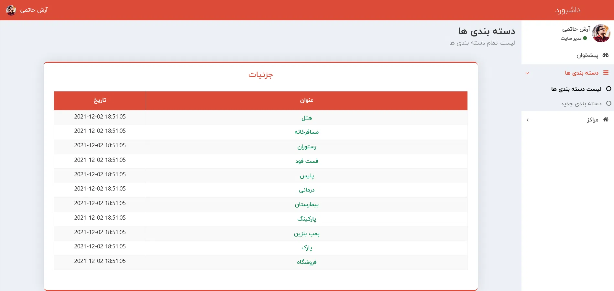
<figcaption>دسته بندی مراکز</figcaption>
</figure>
</h1>

<h1 class="center">
<figure>
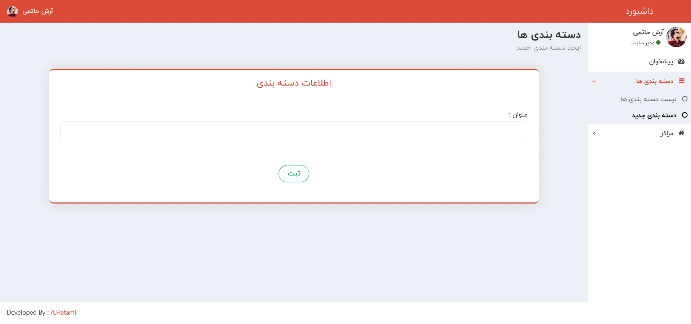
<figcaption>اضافه کردن دسته بندی جدید</figcaption>
</figure>
</h1>

<h1 class="center">
<figure>
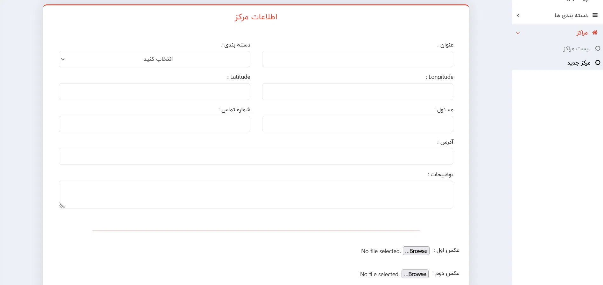
<figcaption>اضافه کردن مرکز جدید</figcaption>
</figure>
</h1>

## اپلیکیشن

با توجه به محدودیت های زمانی و اولویت های کارفرما فقط اپلیکیشن اندروید برای این پروژه توسعه داده شد که با زبان جاوا نوشته شد. در این برنامه چند بخش اصلی وجود داره :

- مشخصات ستاد مرکزی
- لیست و مشخصات مراکز اسکان
- لیست و مشخصات مراکز شهری ( تفریحی ، گردشگری ، درمانی و ... )

همچنین با بهره گرفتن از [نقشه نشان](https://neshan.org/) در این برنامه ، کلیه آدرس ها در نقشه به کاربر نمایش داده میشه و قابلیت مسیریابی لحظه ای هم وجود داره تا مسافر به راحتی بتونه به مرکز مورد نظرش برسه.

<h1 class="center">
<figure>
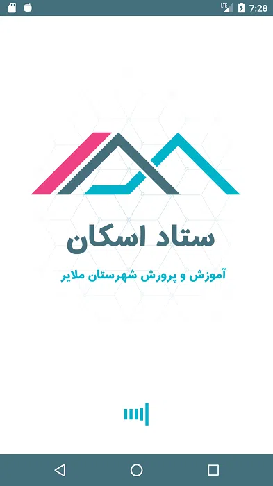
<figcaption>صفحه Splash</figcaption>
</figure>
</h1>

<h1 class="center">
<figure>
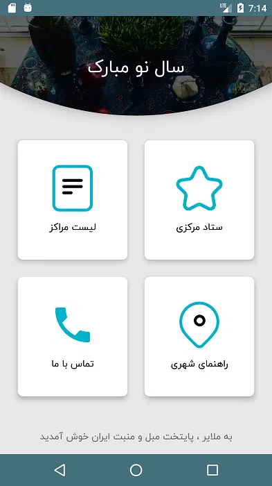
<figcaption>صفحه اصلی</figcaption>
</figure>
</h1>

<h1 class="center">
<figure>
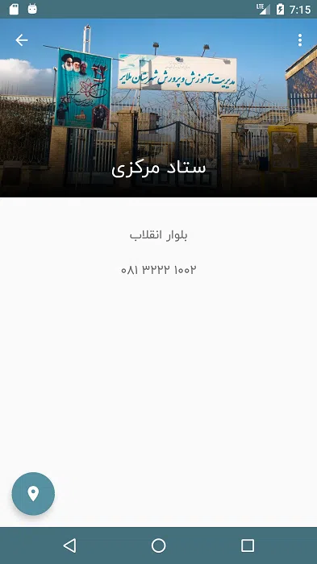
<figcaption>صفحه ستاد مرکزی</figcaption>
</figure>
</h1>

<h1 class="center">
<figure>
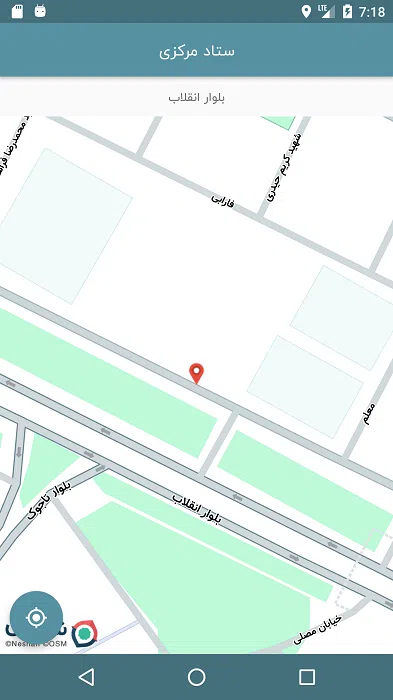
<figcaption>نقشه ستاد مرکزی - مسیریابی</figcaption>
</figure>
</h1>

<h1 class="center">
<figure>
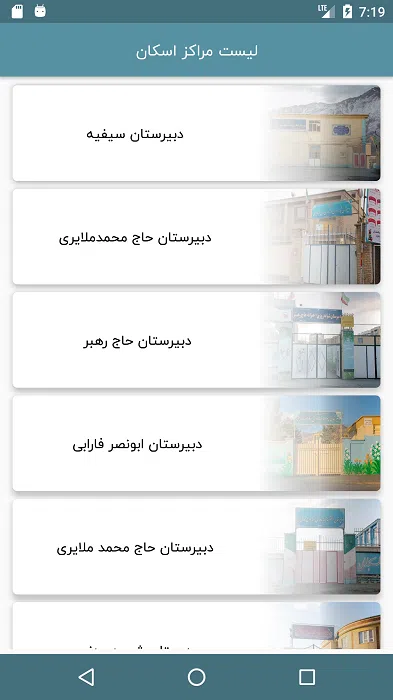
<figcaption>صفحه مراکز ستاد اسکان</figcaption>
</figure>
</h1>

<h1 class="center">
<figure>
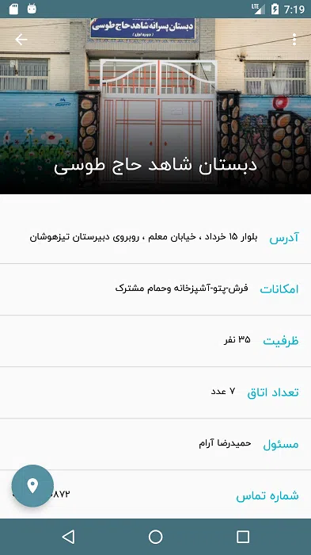
<figcaption>مشخصات مرکز اسکان</figcaption>
</figure>
</h1>

<h1 class="center">
<figure>
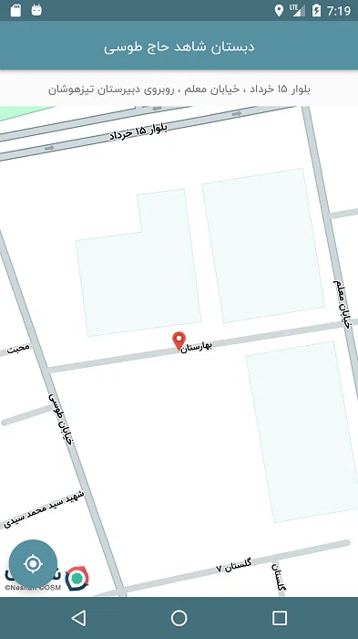
<figcaption>نقشه مرکز اسکان - مسیریابی</figcaption>
</figure>
</h1>

<h1 class="center">
<figure>
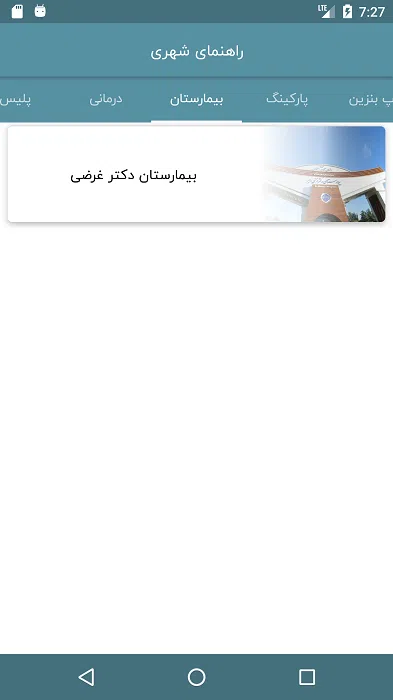
<figcaption>صفحه راهنمای شهری شامل دسته بندی های مختلف و مراکز آن ها</figcaption>
</figure>
</h1>

<h1 class="center">
<figure>
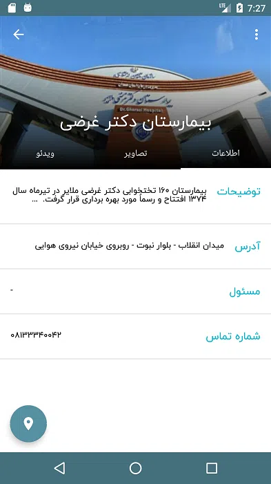
<figcaption>صفحه مشخصات مرکز شهری</figcaption>
</figure>
</h1>
