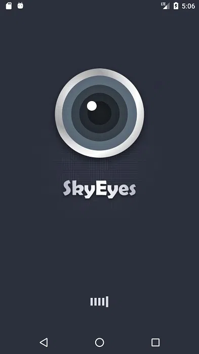
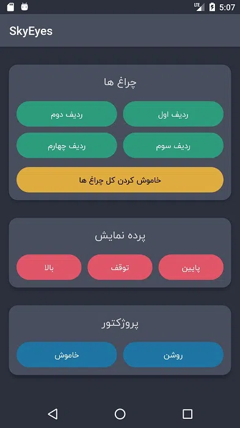

<h1 class="center">

</h1>



این پروژه در سال 1398 به سفارش [دانشگاه ملی ملایر](https://malayeru.ac.ir/portal/home/) طراحی شد. پروژه ای شامل دو بخش سخت افزار و نرم افزار جهت مدیریت کلاس های هوشمند که قسمت سخت افزاری آن به اجزای مختلف کلاس درس مانند چراغ ها ، پروژکتور و پرده نمایش آن متصل شده تا بتواند آن ها را مدیریت کند و در سمت دیگر اپلیکیشن اندرویدی آن روی تبلتی که در اختیار استاد/مسئول مربوطه قرار میگیرد نصب شده تا بتواند اجزای ذکر شده ی فوق را کنترل نماید.

ارتباط بین سخت افزار و نرم افزار با ماژول های وایرلس در باند 2.4 گیگاهرتز صورت می پذیرد.

<h1 class="center">
<figure>

<figcaption>صفحه Splash</figcaption>
</figure>
</h1>

<h1 class="center">
<figure>

<figcaption>صفحه اصلی</figcaption>
</figure>
</h1>
