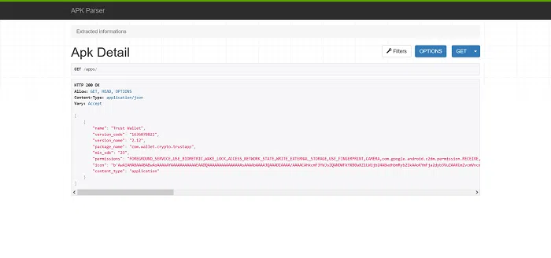
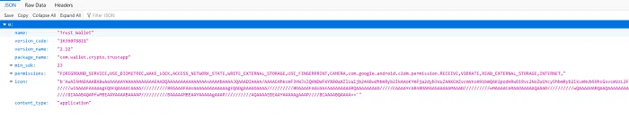

<h1 class="center">

</h1>

 

<ul>
    <li>
        سال طراحی : 1398
    </li>
    <li>
        فریمورک / زبان برنامه نویسی : Python ( Django )
    </li>
    <li>
        تکنولوژی ها :  Django Rest Framework - XML و ...
    </li>
</ul>

این پروژه یک API ساده و کامل جهت Parse کردن فایل های اندرویدی شما است. بدین صورت که فایل ( یا آدرس آن ) را به سامانه داده و مشخصات آن را دریافت می کنید. اطلاعاتی شامل :

- name
- package name
- version code
- version name
- min sdk
- permissions
- icon

قابل ذکره که آیکون برنامه به صورت یک رشته در قالب base64 به شما داده میشه تا بتونید همه جا ازش استفاده کنید.

مزایای اصلی این Parser در پروژه هایی مانند مارکت های اندرویدی نمایان میشه ، به صورتی که وقتی کاربران فایل های اندرویدی خودشون رو بارگذاری می کنن تمام داده های اون فایل استخراج و نمایش داده میشه ( تعریف از خود نباشه ، خیلی از مال کافه بازار سریع تره 😁 ).

در حال حاضر این پروژه به فروش رفته و دسترسی عمومی برای آن وجود نداره. در صورت نیاز به صورت خصوصی پیاده سازی میشه.

<h1 class="center">
<figure>

<figcaption>مشخصات - صفحه DRF</figcaption>
</figure>
</h1>

<h1 class="center">
<figure>

<figcaption>مشخصات در قالب JSON</figcaption>
</figure>
</h1>
