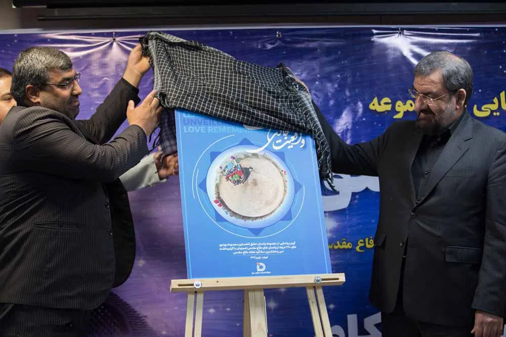
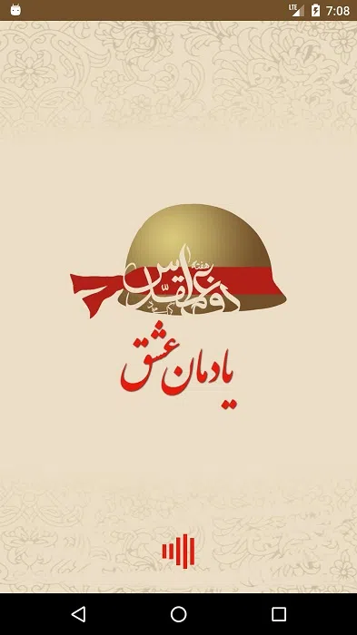
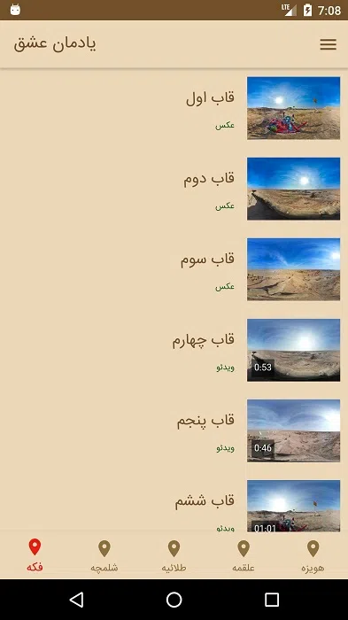
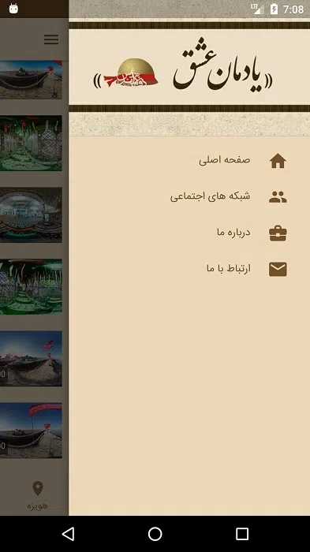
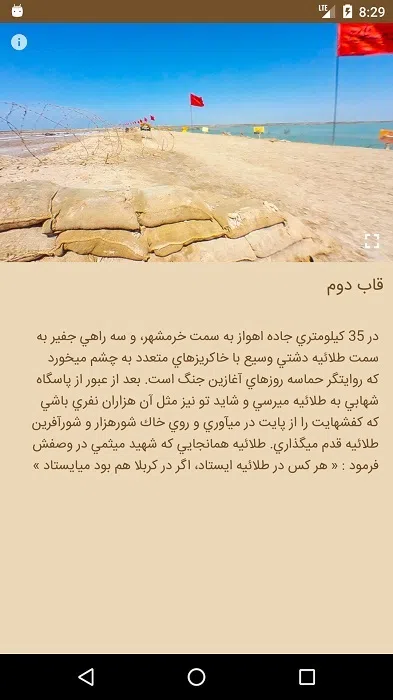
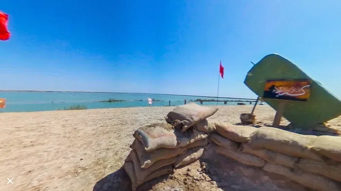
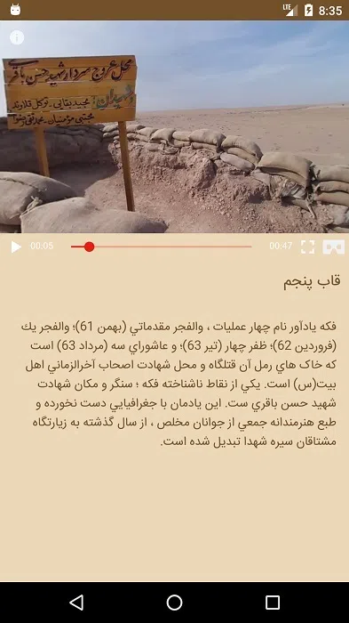
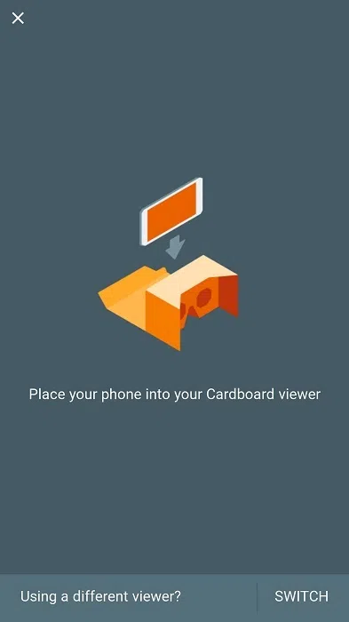

<h1 class="center">

</h1>



این پروژه در مهرماه 1397 به سفارش سراج انجام شد و اولین مجموعه واقعیت مجازی یادمان‌های دفاع مقدس بود که شامل تصاویر و ویدئوهای واقعیت مجازی از مناطق عملیاتی 8 سال دفاع مقدس است. مناطقی شامل فکه ، شلمچه ، طلائیه ، علقمه ، هویزه که به شرح زیر می باشد :

- ۲۱ تصویر ۳۶۰ درجه از شش یادمان شلمچه، طلائیه، علقمه، هویزه، معراج شهدای اهواز و یادمان شهید باقری
- ۴ آیتم ویدئوی ۳۶۰ درجه از یادمان شهدای علقمه در منطقه عملیاتی کربلای ۴ و محل عروج شهدای غواص
- ۳ آیتم ویدئوی ۳۶۰ درجه از یادمان شهدای فکه و محل شهادت شهید سرافراز اسلام شهید سرلشگر حسن باقری
- آیتم ویدئوی ۳۶۰ درجه از یادمان شهدای هویزه و مزار شهید علم‌الهدی و شهدای دانشجو
- ۴ آیتم ۳۶۰ درجه از یادمان شهدای شلمچه مشهورترین یادمان دفاع مقدس و قدمگاه امام رضا علیه‌السلام در سرزمین نور
- ۳ آیتم ویدئوی ۳۶۰ درجه از معراج شهدای طلائیه
- ویدئوی ۳۶۰ درجه از معراج شهدای اهواز و از درون ضریح این مکان مقدس

> این اپلیکیشن با عینک های واقعیت مجازی سازگاری کامل داشته و محتوای تصویری و ویدئویی را در قالب VR پخش می کند.

لینک اخبار :

[ایسنا - رونمایی از مجموعه "یادمان عشق" در هفته دفاع مقدس](https://www.isna.ir/news/97062613542/%D8%B1%D9%88%D9%86%D9%85%D8%A7%DB%8C%DB%8C-%D8%A7%D8%B2-%D9%85%D8%AC%D9%85%D9%88%D8%B9%D9%87-%DB%8C%D8%A7%D8%AF%D9%85%D8%A7%D9%86-%D8%B9%D8%B4%D9%82-%D8%AF%D8%B1-%D9%87%D9%81%D8%AA%D9%87-%D8%AF%D9%81%D8%A7%D8%B9-%D9%85%D9%82%D8%AF%D8%B3)

[ستاد مرکزی راهیان نور کشور - رونمایی از مجموعه «یادمان عشق» اولین مجموعه واقعیت مجازی یادمان‌های دفاع مقدس](http://www.rahianenoor.com/fa/news/12878/%D8%B1%D9%88%D9%86%D9%85%D8%A7%DB%8C%DB%8C-%D9%85%D8%AC%D9%85%D9%88%D8%B9%D9%87-%DB%8C%D8%A7%D8%AF%D9%85%D8%A7%D9%86-%D8%B9%D8%B4%D9%82-%D8%A7%D9%88%D9%84%DB%8C%D9%86-%D9%88%D8%A7%D9%82%D8%B9%DB%8C%D8%AA-%D9%85%D8%AC%D8%A7%D8%B2%DB%8C-%DB%8C%D8%A7%D8%AF%D9%85%D8%A7%D9%86-%D9%87%D8%A7%DB%8C-%D8%AF%D9%81%D8%A7%D8%B9-%D9%85%D9%82%D8%AF%D8%B3)

## اجرا در مدارس

این پروژه دارای یک اپلیکیشن آزمایشی تحت ویندوز نیز بود که پس از رونمایی در مدارس هم برای دانش آموزان به اجرا درآمد

<h1 class="center">
<figure>
 <video width="320" height="615" controls>
  <source src="../assets/img/yad_8.webm" type="video/mp4">
Your browser does not support the video tag.
</video>
</figure>
</h1>

## تصاویر برنامه

<h1 class="center">
<figure>

<figcaption>صفحه Splash</figcaption>
</figure>
</h1>

<h1 class="center">
<figure>

<figcaption>صفحه اصلی</figcaption>
</figure>
</h1>

<h1 class="center">
<figure>

<figcaption>صفحه Navigation</figcaption>
</figure>
</h1>

<h1 class="center">
<figure>

<figcaption>صفحه جزئیات محتوای تصویری</figcaption>
</figure>
</h1>

<h1 class="center">
<figure>

<figcaption>نمایش تصویر 360 درجه</figcaption>
</figure>
</h1>

<h1 class="center">
<figure>

<figcaption>صفحه جزئیات محتوای ویدئویی VR</figcaption>
</figure>
</h1>

<h1 class="center">
<figure>

<figcaption>رفتن به حالت VR و نمایش ویدئو</figcaption>
</figure>
</h1>
