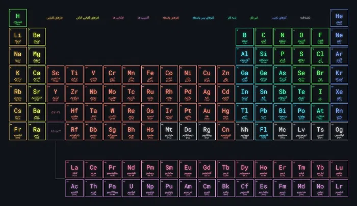
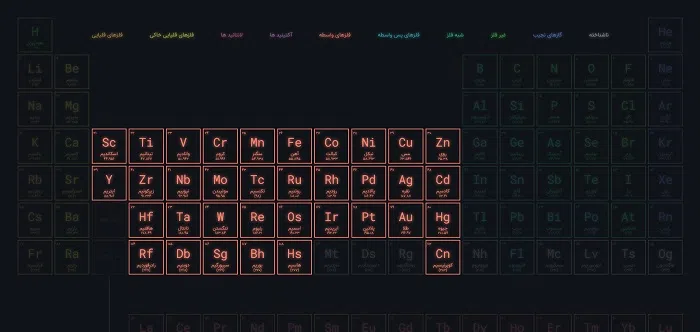
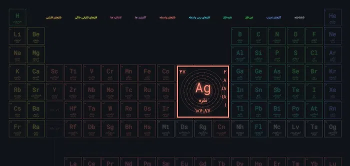

<h1 class="center">

</h1>

<h2 class="center">


</h2>



این پروژه که فقط با استفاده از CSS طراحی شده است جدول تناوبی عناصر را به شما نمایش می دهد. همچنین با کلیک کردن روی هر عنصر اطلاعاتی نیز در اختیار شما قرار می گیرد از جمله :

- عدد اتمی
- جرم اتمی
- لایه الکترونی به همراه ترسیم آن

دسته بندی های کلی عناصر هم در بالای صفحه قرار داده شده که با کلیک روی هرکدام ، عناصر آن گروه متمایز خواهند شد

> نام فارسی و اطلاعات عناصر از ویکی پدیا گرفته شده است : [آدرس](https://fa.wikipedia.org/wiki/%D9%81%D9%87%D8%B1%D8%B3%D8%AA_%D8%B9%D9%86%D8%A7%D8%B5%D8%B1_%D8%AC%D8%AF%D9%88%D9%84_%D8%AA%D9%86%D8%A7%D9%88%D8%A8%DB%8C)

## تصاویر

<h1 class="center">
<figure>

<figcaption>صفحه اصلی</figcaption>
</figure>
</h1>

<h1 class="center">
<figure>

<figcaption>انتخاب دسته بندی</figcaption>
</figure>
</h1>

<h1 class="center">
<figure>

<figcaption>جزئیات عنصر</figcaption>
</figure>
</h1>
