<h1 class="center">
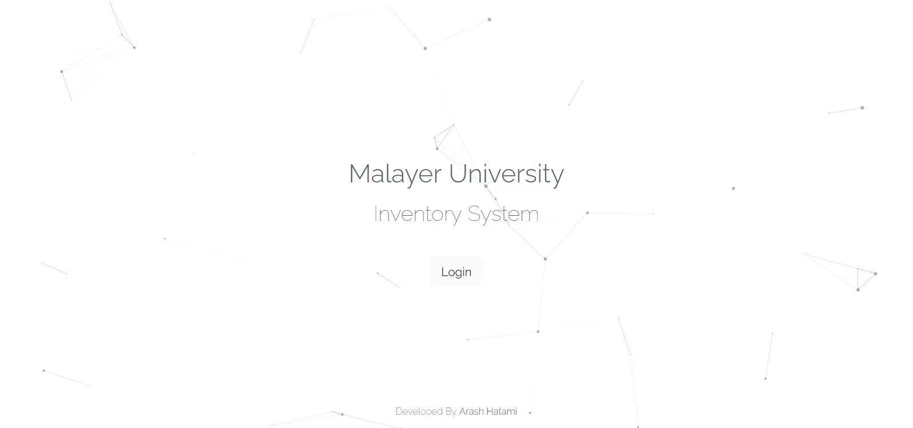
</h1>



این پروژه در سال 1398 به سفارش [دانشگاه ملی ملایر](https://malayeru.ac.ir/portal/home/) طراحی شد. با توجه به سیستم سنتی انبار داری موجود در آن زمان ، برنامه ریزی هایی انجام شد تا ساز و کار به صورت دیجیتالی انجام شده و سیستم کاغذی از بین برود. روند انبارداری شامل ساختمان ها ، طبقات ، اتاق ها ، مسئولین و کالاهای مختلف بود که ثبت و مدیریت و بازرسی هرکدام از آن ها با توجه به گسترش فضای فیزیکی دانشگاه کار دشوار و طولانی بود.

این پروژه شامل یک بخش مدیریتی بوده که کلیه اطلاعات در آن وارد می شوند. اعم از ساختمان ها و طبقات و غیره. سپس روند تخصیص و مدیریت کالا ها از طریق اپلیکیشن موبایل صورت پذیرفته تا متصدی از سرعت عمل و دقت بالاتری بهره مند شود.

## تصاویر

> داده های موجود در این تصاویر آزمایشی هستند

<h1 class="center">
<figure>
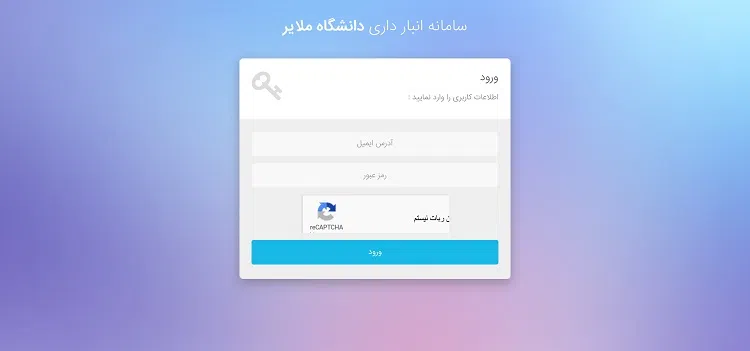
<figcaption>صفحه ورود</figcaption>
</figure>
</h1>

<h1 class="center">
<figure>
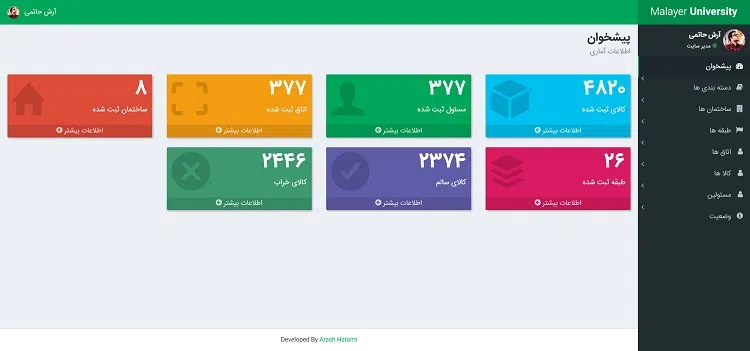
<figcaption>صفحه اصلی پنل مدیریت</figcaption>
</figure>
</h1>

<h1 class="center">
<figure>
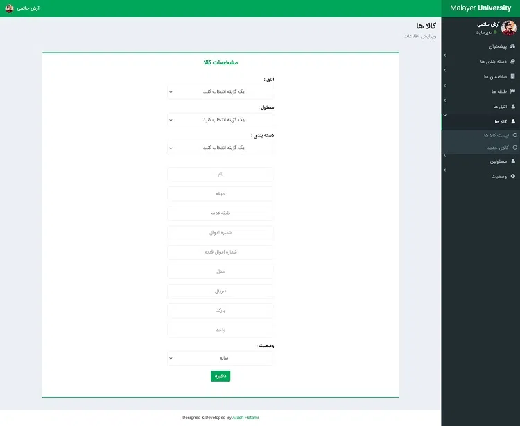
<figcaption>صفحات مدیریت اطلاعات - ثبت کالا</figcaption>
</figure>
</h1>

### اپلیکیشن اندروید

> داده های موجود در این تصاویر آزمایشی هستند

<h1 class="center">
<figure>
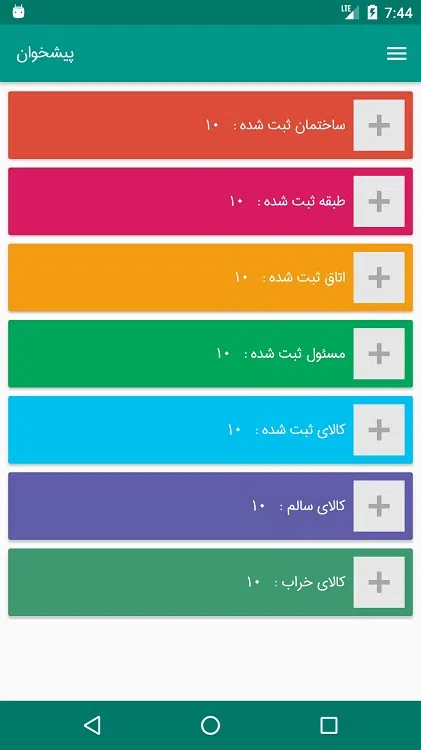
<figcaption>صفحه اصلی</figcaption>
</figure>
</h1>

<h1 class="center">
<figure>
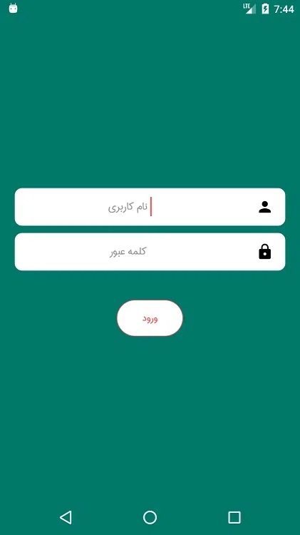
<figcaption>ورود به حساب کاربری</figcaption>
</figure>
</h1>

<h1 class="center">
<figure>
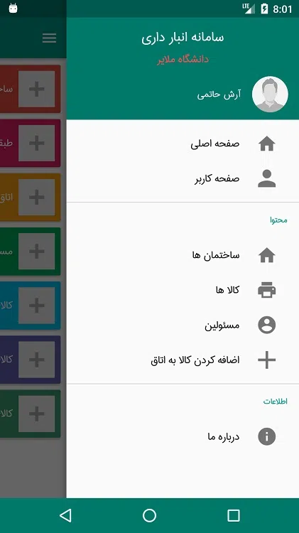
<figcaption>منو</figcaption>
</figure>
</h1>

<h1 class="center">
<figure>
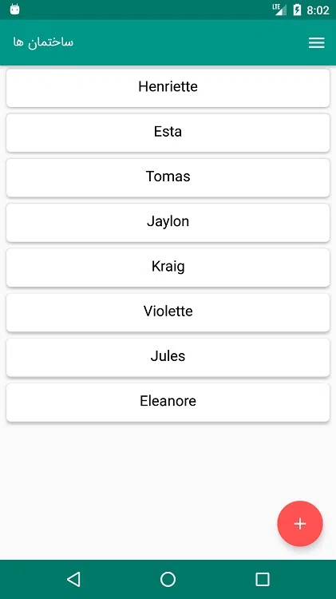
<figcaption>لیست ساختمان ها</figcaption>
</figure>
</h1>

<h1 class="center">
<figure>
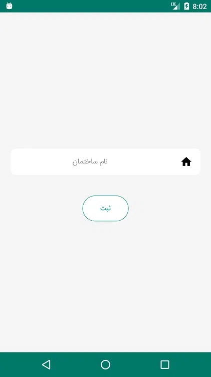
<figcaption>ثبت ساختمان جدید</figcaption>
</figure>
</h1>

<h1 class="center">
<figure>
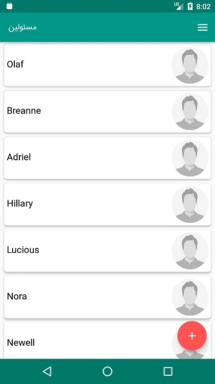
<figcaption>لیست مسئولین</figcaption>
</figure>
</h1>

<h1 class="center">
<figure>
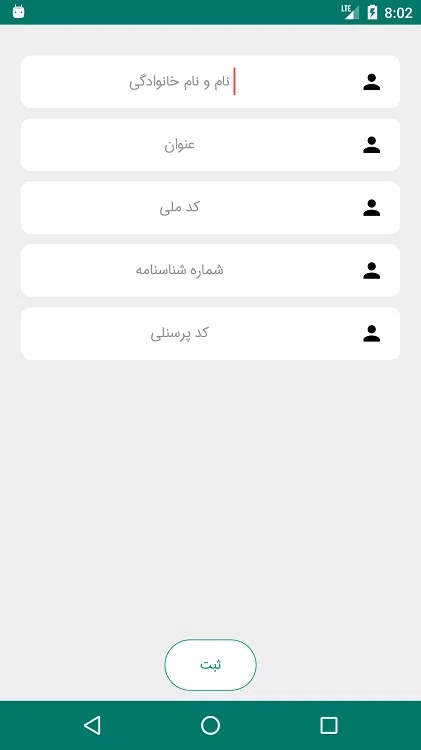
<figcaption>ثبت مسئول جدید</figcaption>
</figure>
</h1>

<h1 class="center">
<figure>
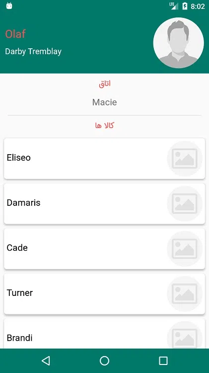
<figcaption>مشخصات مسئول - شامل ساختمان ، طبقه ، اتاق و لیست کالا ها</figcaption>
</figure>
</h1>

### تخصیص کالا

روند اضافه کردن کالا به اتاق به این شکل است که هر اتاق یک بارکد اختصاصی داشته که در قسمت ورودی نصب می شود. و مسلما هر کالایی نیز بارکد تعریف شده ی خود را دارد. با اسکن این دو بارکد می توان به راحتی کالا را به ان اتاق اضافه کرد.

<h1 class="center">
<figure>
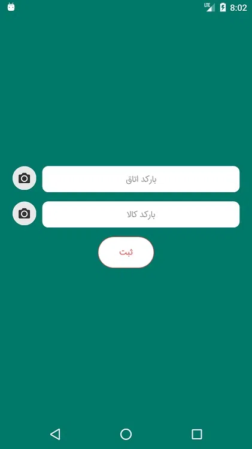
<figcaption>اضافه کردن کالا به اتاق</figcaption>
</figure>
</h1>

<h1 class="center">
<figure>
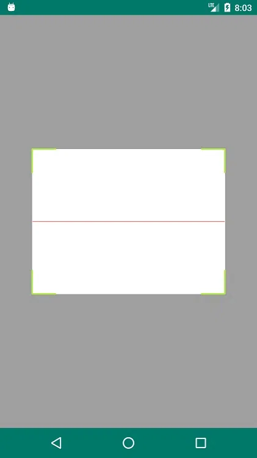
<figcaption>اسکن بارکد</figcaption>
</figure>
</h1>

