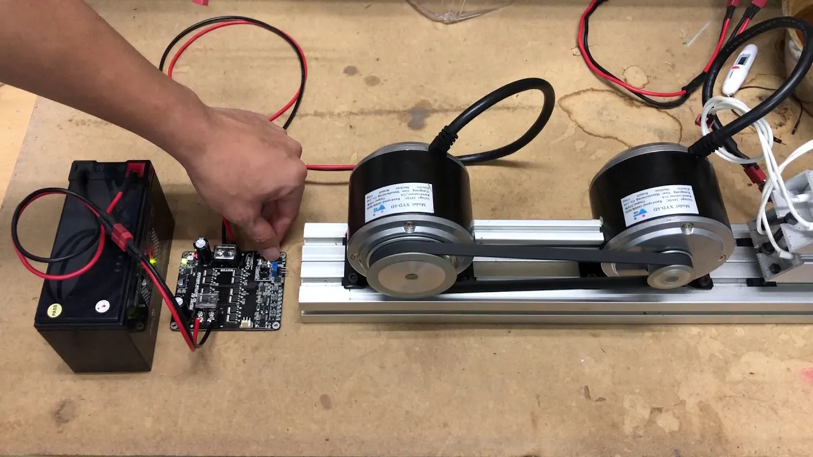
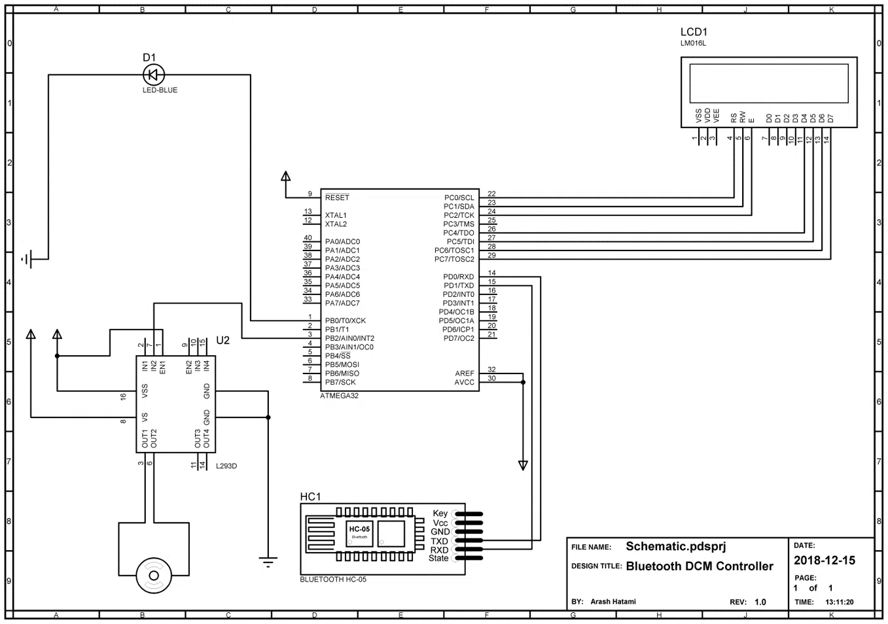
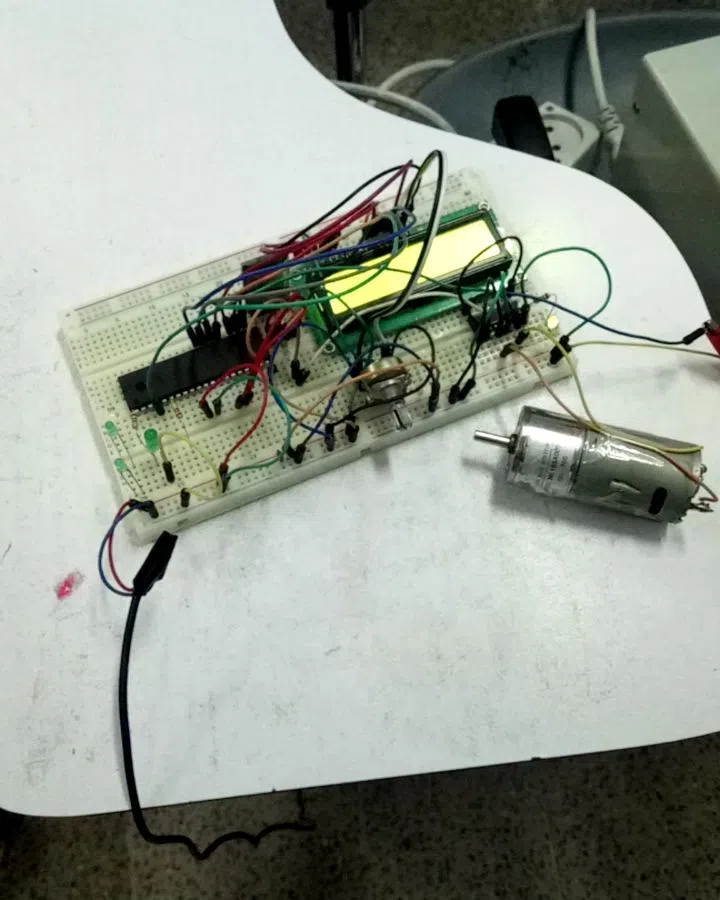
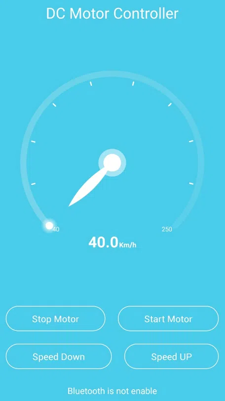

<h1 class="center">

</h1>



این پروژه در قالب یکی از اجزای پروژه IOT بزرگتر طراحی و توسعه داده شد. در ابتدا یک کار ساده دانشجویی بود که در سال 1399 واگذار شد و با طرح دیگری ادغام شد. اولویت این پروژه پیاده سازی کامل بود و به همین دلیل از برد های الکترونیکی آماده مانند آردوینو و رزبری پای استفاده نشد.

در نمونه اولیه تمامی قطعات روی برد بورد اسمبل شد و پس از واگذاری به صورت حرفه ای تر روی بورد های چندلایه پیاده سازی شد. اجزای تشکیل دهنده سیستم :

- موتور DC
- ماژول بلوتوث HC05
- درایور L293D
- اپلیکیشن اندروید
- نمایشگر LM016L
- میکروکنترلر ATMega32

در نسخه اولیه اپلیکیشن اندرویدی از طریق بلوتوث به ماژول HC05 متصل شده و دستورات کنترل موتور مانند افزایش/کاهش سرعت و خاموش روشن را به میکروکنترلر ارسال می کند. میکروکنترلر با استفاده از درایور موتور ، ادامه کار را انجام داده و با PWM سرعت موتور را کنترل خواهد کرد.

## شماتیک مدار

<h1 class="center">
<figure>

</figure>
</h1>

## نسخه اولیه

<h1 class="center">
<figure>

</figure>
</h1>

## اپلیکیشن اندروید

<h1 class="center">
<figure>

</figure>
</h1>

## ویدئو تست نسخه اولیه

<h1 class="center">
<figure>
 <video width="360" height="450" controls>
  <source src="../assets/img/remote_dcm_5.webm" type="video/mp4">
Your browser does not support the video tag.
</video> 
</figure>
</h1>
