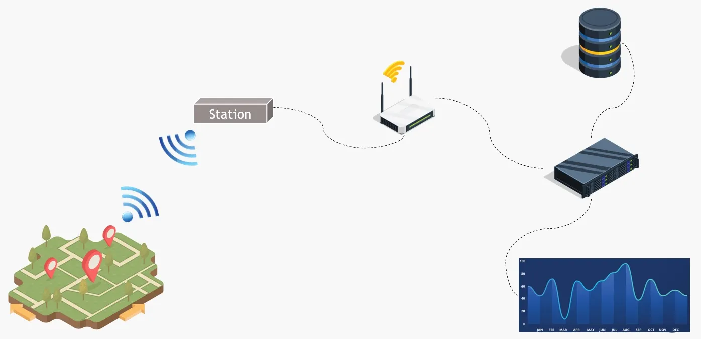
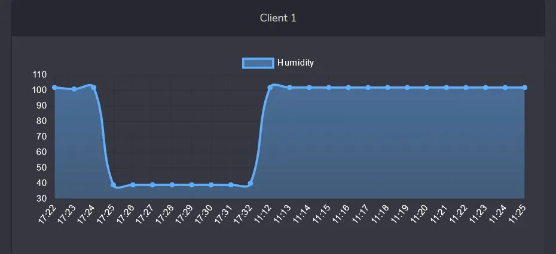
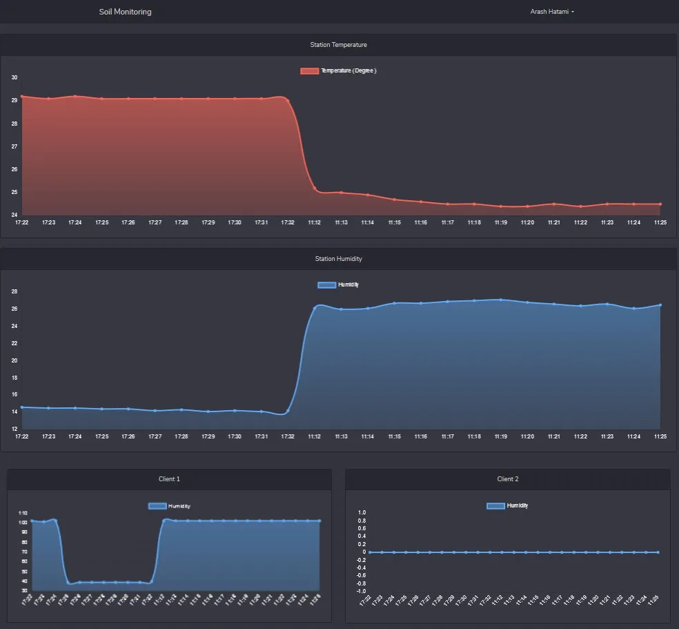

<h1 class="center">

</h1>



این پروژه با هدف پایش اطلاعات اولیه خاک در زمین های کشاورزی توسعه پیدا کرد. پس از به دست آوردن دما و رطوبت خاک می‎توان به راحتی مدیریت خودکار و هوشمندی روی آبیاری انجام داد. این پروژه به سفارش دانشگاه ملی ملایر در سال 1398 انجام شد.

اجزای تشکل دهنده این پروژه بدین شرح است :

- سنسور های YL69 جهت دریافت اطلاعات خاک
- ماژول های ESP جهت ارسال داده ها به Gateway
- یک RaspberryPi به عنوان Gateway جهت جمع آوری داده ها و ارسال آن ها به سرور
- سرور مرکزی جهت آرشیو و نمایش داده های دریافتی

<h1 class="center">

</h1>

سمت سرور از فریمورک Laravel جهت مدیریت API و داشبورد مدیریتی استفاده شده است. داده های هر سنسور ( هر بخش از زمین ) با نمودارهای جداگانه نمایش داده خواهند شد.

<h1 class="center">

</h1>

در مراحل بعدی پردازش های تکمیلی روی داده های دریافت شده بر اساس پارامتر های مورد نظر انجام خواهد شد تا به نتایج مفیدی برسیم از جمله :

- بهترین زمان آبیاری زمین
- تنظیم میزان آبیاری
- کنترل هوشمند روند آبیاری با استفاده از دستگاه ها و موتورها و ...
- ...
