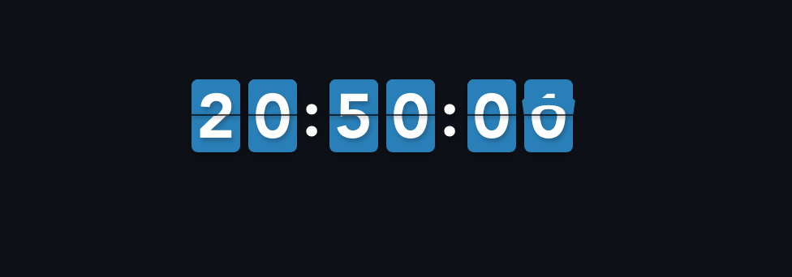

<h2 class="center">


</h2>



[](https://GitHub.com/hatamiarash7/vue-flip-clock/releases/)

در برخی پروژه ها نیاز به طراحی و پیاده سازی ساعت دیجیتال دارید. این پروژه یک ساعت Flip برای Vue JS است که می توانید آن را در وبسایت خود استفاده کنید. نیازمندی های کمی داشته و استفاده از آن خیلی ساده است.

<h1 class="center">

</h1>

## نصب

ابتدا کتابخانه را با استفاده از NPM نصب کنید.

```bash
npm i @hatamiarash7/vue-flip-clock --save
```

سپس آن را در پروژه خود وارد کنید.

```js
import Clock from "@hatamiarash7/vue-flip-clock";
import "@hatamiarash7/vue-flip-clock/dist/vue-flip-clock.css";

Vue.component("flip-clock", Clock);
```

> می توانید از `Vue.use` یا `Vue.component` استفاده کنید.

در نهایت Component را در صفحه خود قرار دهید.

```html
<template>
  ...
  <flip-clock innerColor="#2980b9" />
  ...
</template>
```

## تنظیمات

تنها تنظیماتی که برای این کتابخانه در نظر گرفته شده ٬ قابلیت تغییر رنگ ساعت است که با استفاده از `innerColor` قابل تنظیم است.

```html
<flip-clock innerColor="#2980b9" />
```
